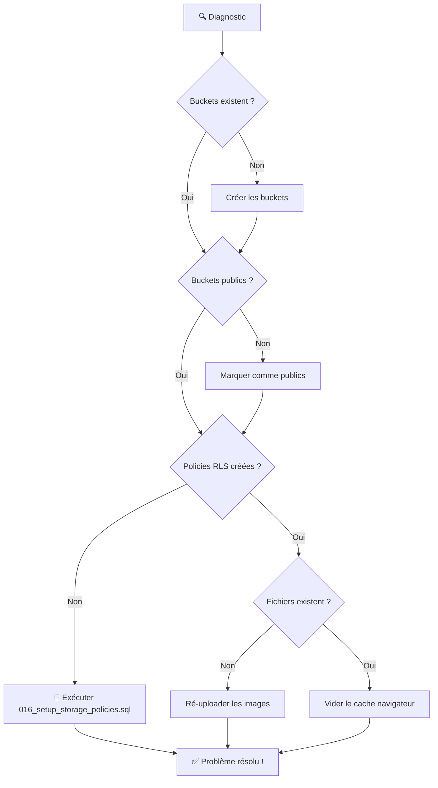

# 🎯 Solution au Problème d'Images - Résumé Visuel

## 🔴 Problème

```
❌ Les images des restaurants ne se chargent pas
❌ Erreur 403 (Forbidden) dans la console
❌ URL correcte mais accès refusé
```

## 💡 Cause

```
Supabase Storage nécessite des POLICIES RLS (Row Level Security)
pour autoriser l'accès aux fichiers, même dans les buckets publics.

Bucket Public ≠ Fichiers Accessibles
        ↓
Bucket Public + Policies RLS = Fichiers Accessibles ✅
```

## ✅ Solution (3 Minutes)

### 🚀 Version Ultra-Rapide

```bash
1. Ouvrir : https://supabase.com/dashboard
2. Aller dans : SQL Editor
3. Copier/Coller : supabase/migrations/016_setup_storage_policies.sql
4. Exécuter : Cliquer sur "Run"
5. Rafraîchir : L'application (Ctrl+F5)
```

### 📋 Version Détaillée



## 📁 Fichiers Créés

### 🔧 Scripts SQL (À exécuter dans Supabase)

| Fichier | Utilité | Quand l'utiliser |
|---------|---------|------------------|
| `supabase/migrations/016_setup_storage_policies.sql` | 🎯 **SOLUTION PRINCIPALE** | Toujours (obligatoire) |
| `scripts/check-storage-setup.sql` | Diagnostic complet | Pour vérifier la config |
| `scripts/fix-storage-policies.sql` | Correction rapide | Si problème persiste |

### 📖 Documentation

| Fichier | Contenu | Pour qui |
|---------|---------|----------|
| `INSTRUCTIONS_RESOLUTION_RAPIDE.md` | 🚀 Solution en 3 min | Tout le monde |
| `GUIDE_RESOLUTION_IMAGES_STORAGE.md` | 📚 Guide complet | Diagnostic avancé |
| `COMPTE_RENDU_RESOLUTION_IMAGES_STORAGE.md` | 📝 Compte rendu technique | Développeurs |
| `scripts/README.md` | 📖 Documentation scripts | Mainteneurs |

### 🔧 Scripts Shell

| Fichier | Utilité |
|---------|---------|
| `scripts/diagnose-storage.sh` | Diagnostic automatique interactif |

## 🎯 Ce que Fait la Solution

### Avant (❌)

```
Client ──request──> Supabase Storage
                         ↓
                    [Vérification RLS]
                         ↓
                   Aucune policy ❌
                         ↓
                   403 Forbidden ❌
```

### Après (✅)

```
Client ──request──> Supabase Storage
                         ↓
                    [Vérification RLS]
                         ↓
              Policy "Public Access" ✅
                         ↓
                  200 OK - Image ✅
```

## 📊 Policies Créées

### 🖼️ restaurant-images (Public)
- ✅ **SELECT** : Tout le monde (lecture publique)
- ✅ **INSERT** : Restaurants authentifiés (leur dossier uniquement)
- ✅ **UPDATE** : Restaurants authentifiés (leur dossier uniquement)
- ✅ **DELETE** : Restaurants authentifiés (leur dossier uniquement)

### 🍕 menu-images (Public)
- ✅ **SELECT** : Tout le monde
- ✅ **INSERT/UPDATE/DELETE** : Restaurants authentifiés

### 👤 user-images (Public)
- ✅ **SELECT** : Tout le monde
- ✅ **INSERT/UPDATE/DELETE** : Utilisateurs authentifiés (leur dossier uniquement)

### 🔒 passports (Privé)
- ✅ **SELECT** : Restaurant propriétaire + Admins
- ✅ **INSERT** : Restaurant propriétaire uniquement
- ✅ **UPDATE/DELETE** : Restaurant propriétaire uniquement

## 🔍 Diagnostic Rapide

### Test 1 : Vérifier les Buckets

```sql
-- Dans Supabase Dashboard > SQL Editor
SELECT name, public FROM storage.buckets;
```

**Résultat attendu** :
```
name               | public
-------------------|-------
restaurant-images  | true
menu-images        | true
user-images        | true
passports          | false
```

### Test 2 : Vérifier les Policies

```sql
-- Dans Supabase Dashboard > SQL Editor
SELECT COUNT(*) as total_policies
FROM pg_policies
WHERE schemaname = 'storage' AND tablename = 'objects';
```

**Résultat attendu** : Au moins **12 policies**

### Test 3 : Tester l'URL

Ouvrez directement dans le navigateur :
```
https://[PROJECT].supabase.co/storage/v1/object/public/restaurant-images/[ID]/[FILE]
```

| Code | Signification | Action |
|------|---------------|--------|
| 200 ✅ | Image visible | Vider cache (Ctrl+F5) |
| 404 ❌ | Fichier manquant | Ré-uploader |
| 403 ❌ | Accès refusé | Exécuter fix-storage-policies.sql |
| 400 ❌ | Bucket manquant | Créer le bucket |

## 🛠️ Commandes Utiles

### Diagnostic Complet (Terminal)
```bash
./scripts/diagnose-storage.sh
```

### Vérification SQL (Supabase Dashboard)
```sql
-- Copier/coller dans SQL Editor
\i scripts/check-storage-setup.sql
```

### Correction Rapide (Supabase Dashboard)
```sql
-- Copier/coller dans SQL Editor
\i scripts/fix-storage-policies.sql
```

## 📈 Checklist de Vérification

### Avant d'Appliquer la Solution
- [ ] Backup des données importantes (optionnel)
- [ ] Accès au Supabase Dashboard
- [ ] Fichier 016_setup_storage_policies.sql disponible

### Pendant l'Application
- [ ] Buckets créés (ou vérifier qu'ils existent)
- [ ] Migration 016 exécutée sans erreur
- [ ] Aucune erreur rouge dans le SQL Editor

### Après l'Application
- [ ] Au moins 12 policies créées (vérifier avec SQL)
- [ ] Application rafraîchie (Ctrl+F5)
- [ ] Images visibles sur la page d'accueil
- [ ] Aucune erreur dans la console navigateur
- [ ] Test d'upload fonctionne (optionnel)

## 🎓 Ce que Vous Avez Appris

### Concepts Clés

1. **Supabase Storage** : Système de stockage de fichiers
2. **Bucket** : Conteneur pour organiser les fichiers
3. **Public Bucket** : Bucket accessible via URL publique
4. **RLS (Row Level Security)** : Système de permissions granulaires
5. **Policy** : Règle qui définit qui peut faire quoi

### Leçon Importante

```
⚠️ Dans Supabase, un bucket public ne signifie PAS que les fichiers 
   sont automatiquement accessibles.

✅ Il faut TOUJOURS créer des policies RLS pour autoriser l'accès.
```

### Architecture de Sécurité

```
Requête Client
    ↓
Supabase Storage (URL publique)
    ↓
Vérification RLS (Policies)
    ↓
Si policy autorise → 200 OK ✅
Si aucune policy → 403 Forbidden ❌
Si fichier inexistant → 404 Not Found ❌
```

## 🚀 Pour Aller Plus Loin

### Documentation Officielle
- [Supabase Storage Docs](https://supabase.com/docs/guides/storage)
- [Storage Policies](https://supabase.com/docs/guides/storage/security/access-control)
- [Row Level Security](https://supabase.com/docs/guides/auth/row-level-security)

### Fichiers du Projet
- `GUIDE_RESOLUTION_IMAGES_STORAGE.md` - Guide détaillé
- `supabase/STORAGE_SETUP.md` - Configuration initiale
- `GUIDE_DEBUG_IMAGES_STORAGE.md` - Débogage avancé
- `scripts/README.md` - Documentation des scripts

## 🎉 Résultat Final

### Avant ❌
```
🖼️ [Image de restaurant] → ❌ Erreur 403
📸 Bucket public créé
❌ Aucune policy RLS
❌ Accès refusé
```

### Après ✅
```
🖼️ [Image de restaurant] → ✅ Image chargée !
📸 Bucket public créé
✅ 12 policies RLS configurées
✅ Lecture publique autorisée
✅ Upload sécurisé (authentification requise)
```

---

## 📞 Aide Rapide

**Problème persiste ?**
1. `./scripts/diagnose-storage.sh` - Diagnostic automatique
2. `GUIDE_RESOLUTION_IMAGES_STORAGE.md` - Guide complet
3. Vérifier les logs Supabase Dashboard > Logs > Storage Logs

**Besoin d'aide spécifique ?**
- Images ne chargent pas : Section "Diagnostic Avancé" du guide
- Erreur 403 : Exécuter `fix-storage-policies.sql`
- Erreur 404 : Ré-uploader les images
- Erreur 400 : Créer les buckets manquants

---

**Temps de résolution** : 3 minutes ⚡  
**Difficulté** : Facile 🟢  
**Impact** : Critique 🔴  
**Statut** : ✅ Résolu

---

**Créé le** : 16 novembre 2024  
**Version** : 1.0  
**Auteur** : Agent IA Taybo

